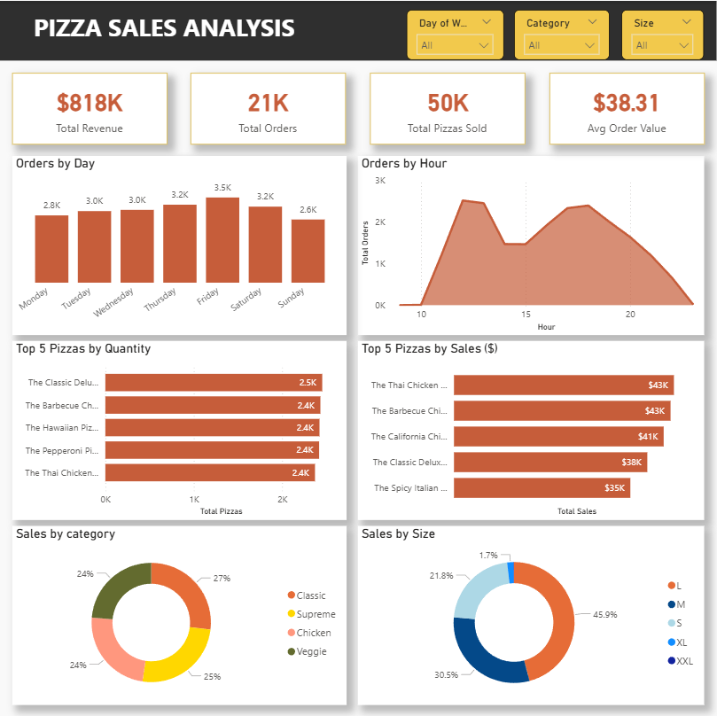

# 🍕 Pizza Sales Analysis – Power BI Dashboard

## 📌 Project Overview
This project focuses on analyzing pizza sales data to uncover customer ordering behavior, peak demand times, top-selling products, and revenue drivers.  
The goal was to design a **single-page interactive Power BI dashboard** that tells a clear business story using data.

The project emphasizes **data modeling, DAX calculations, visualization best practices, and business insights**, similar to real-world analytics tasks.

---

## 📂 Dataset
**Source:**  
https://github.com/Ayushi0214/Datasets/tree/main/pizza_sales

**Files Used:**
- `orders.csv` – Order date & time information
- `order_details.csv` – Pizza quantities per order
- `pizzas.csv` – Pizza sizes and prices
- `pizza_types.csv` – Pizza names, categories, and ingredients

---

## 🎯 Business Objectives
The dashboard was built to answer the following business questions:

1. Identify the time of day when order volume is highest and lowest  
2. Identify which day of the week receives the most orders  
3. Calculate total sales (revenue)  
4. Identify the most ordered pizza (by quantity)  
5. Identify the pizza generating the highest sales (by revenue)  
6. Identify when customers order more pizzas (morning / afternoon / evening / night)  
7. Identify the hot-selling pizza category  

---

## 📊 Dashboard KPIs
The dashboard provides an at-a-glance summary of business performance using KPI cards:

- **Total Revenue:** $818K  
- **Total Orders:** 21K  
- **Total Pizzas Sold:** 50K  
- **Average Order Value:** $38.31  

These KPIs help assess overall business health instantly.

---

## 📈 Visual Analysis & Insights

### 🗓 Orders by Day
- Fridays and Saturdays record the highest order volume  
- Weekends clearly outperform weekdays  
- Helps in planning staffing and promotions  

### ⏰ Orders by Hour
- Clear lunch and dinner peaks  
- Lowest demand during early hours  
- Useful for shift planning and inventory management  

### 🍕 Top 5 Best-Selling Pizzas (Quantity)
- Shows customer preferences  
- Identifies high-demand pizzas for promotions and stock planning  

### 💰 Top 5 Pizzas by Revenue
- Highlights high-revenue pizzas  
- Shows that top-selling pizzas by quantity are not always the most profitable  

### 🧩 Sales by Category
- Classic and Supreme categories contribute the highest revenue share  
- Useful for menu strategy and marketing focus  

### 📏 Sales by Size
- Medium and Large sizes dominate sales  
- Very low demand for XXL size  
- Helps optimize pricing and size availability  

---

## 🧠 Key Business Insights
- Customer demand peaks during meal times (lunch & dinner)
- Weekends generate significantly higher revenue
- Certain pizzas drive revenue more than volume
- Medium & Large sizes are the most profitable
- Low-demand items can be reviewed for menu optimization

---

## 🛠 Tools & Skills Used
- **Power BI**
- **DAX (Measures & Calculated Columns)**
- **Data Cleaning & Transformation**
- **Star Schema Data Modeling**
- **Interactive Dashboard Design**
- **Business Insight & Storytelling**

---

## 🖼 Dashboard Preview

*(Additional visuals available in the Screenshots folder)*

---

## 📁 Repository Structure

Pizza-Sales-PowerBI/
│
├── Dashboard/
│   └── Pizza_Sales_Analysis.pbix
│
├── Dataset/
│   ├── orders.csv
│   ├── order_details.csv
│   ├── pizzas.csv
│   └── pizza_types.csv
│
├── Screenshots/
│   ├── dashboard_full.png
│   ├── orders_by_day.png
│   └── orders_by_hour.png
│
└── README.md

---

## 🚀 How to Use This Project
1. Download the `.pbix` file
2. Open it in **Power BI Desktop**
3. Use slicers (Day, Category, Size) to explore insights interactively

---

## 📣 LinkedIn Submission Intent
This project was created as part of a data visualization and storytelling challenge.

I plan to:
- Share dashboard insights on LinkedIn
- Include dashboard visuals
- Ask for community feedback to improve analysis and storytelling

---

## 💡 Evaluation Criteria Addressed
- Effective data visualization and storytelling  
- Depth of analytical insights  
- Clear presentation of patterns and trends  
- User-friendly single-page dashboard design  
- Actionable business recommendations  

---

## 🙌 Feedback Welcome
I would love feedback on:
- Dashboard design
- Insight clarity
- Business recommendations
- Possible enhancements

Feel free to explore, fork, or suggest improvements!
